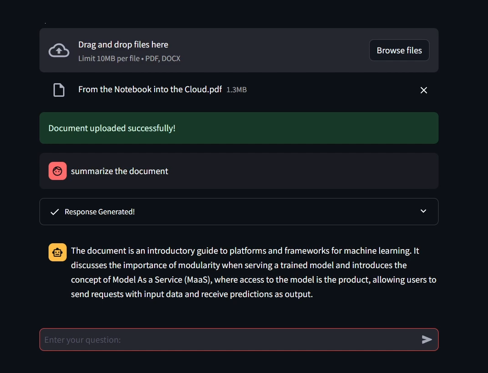

# corrective-rag-llama3



Corrective RAG  application using LLAMA3 8B

## Installation Instructions

1. Install Ollama and LLAMA3 8B:Instruct.

2. Install dependencies:

    ```bash
    pip install -r requirements.txt
    ```

3. Run the webapp:

    ```bash
    streamlit run app.py
    ```
